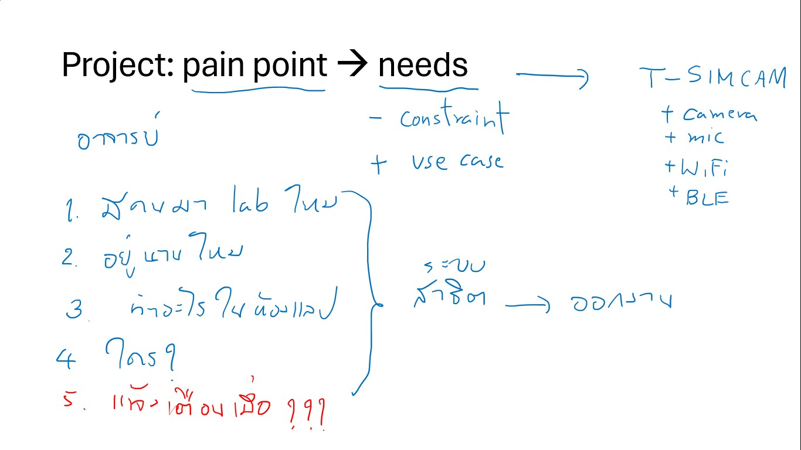

# Repository for CN466 Internet of Things 2024

## Lab monitoring system
This repository is to collect the mini-project of CN466 IoT course at Thammasat University. The scope of the project is to cover required skills and knowledge of IoT platform development. Therefore, students can learn and practice how to develop IoT prototype system. The 2024 course emphasizes on the development of edge computing devices using T-SIMCAM boards (ESP32 + camera) to acquire images, detect human, and send information to server.

## Ideas
1. 
2. 
3. 
4. 
5. 

### User stories
1. As a **staff**, I would like to **activate the system easily**, so that **I can start demo**.
  - 
2. As a **staff**, I would like to **check status simply**, so that **I can show key features impressively**.
  - 

### Requirements: device firmware
1. acquire image from camera.
2. detect environment changes based on brightness and time status.
3. detect human in the image using TinyML approach.
4. summarize activities in room.
5. submit data via MQTT broker.

### Requirements: IoT data collector
1. collect data from MQTT broker.
2. store data in database.

### Requirements: IoT API
1. accept and parse request.
2. query database.
3. return activity status.

### Requirements: LINE UI
1. provide UI via LINE bot.
2. generate LIFF UI.

### Requirements: LIFF interface
1. generate Onsen UI.

## Project structure
1. **/t_simcam**: Platform.io project for Lilygo T-SIMCAM
 
2. **/docker**: Docker structure for API.
  1. **room_collector**: MQTT app to collect data
  2. **room_api**: endpoints for LINE messaging API and REST API
  3. **room_ui**: UI for controller 

## Student list
